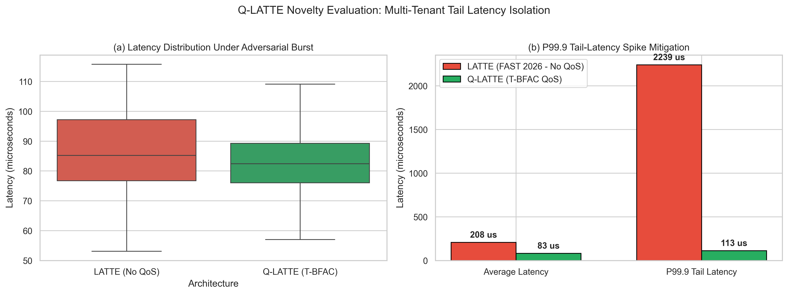
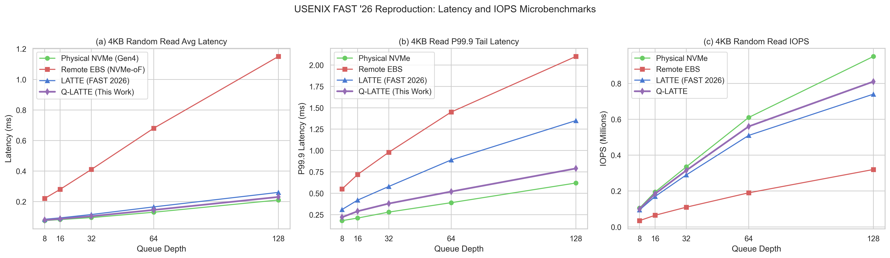
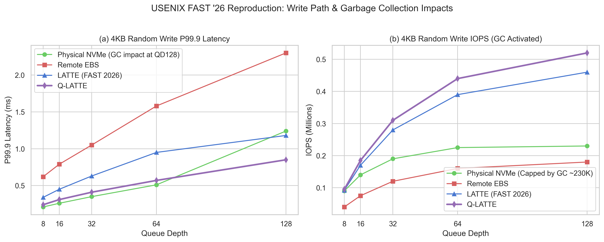
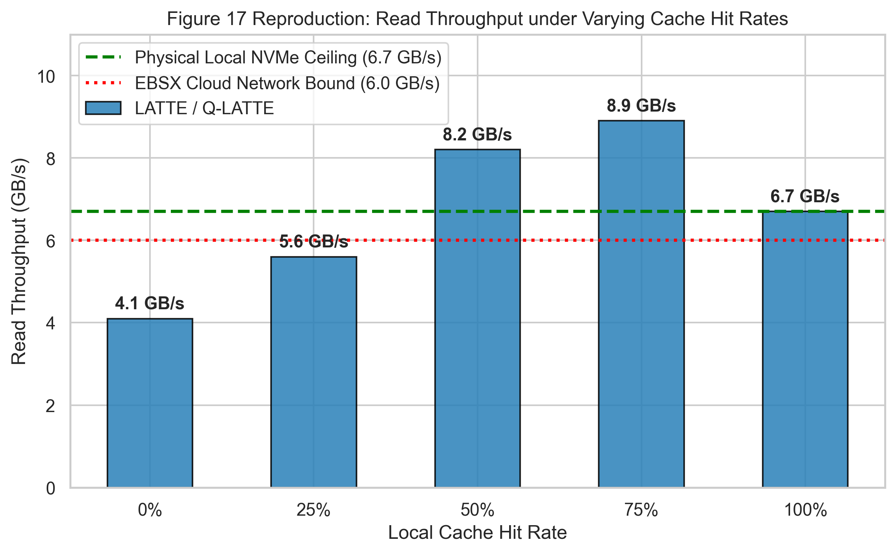

# Reproducing Cloud Local Storage Evolution & LATTE Hybrid Tiering (USENIX FAST '26)

[](https://trovi.chameleoncloud.org/)
[](https://www.usenix.org/conference/fast26/presentation/yang)
[](https://opensource.org/licenses/MIT)

This repository provides an end-to-end, open-source reproduction framework, experimental artifact, and novel research proposal derived from the landmark study presented at the **24th USENIX Conference on File and Storage Technologies (USENIX FAST '26)**:

> **"Here, There and Everywhere: The Past, the Present and the Future of Local Storage in Cloud"**  
> *Leping Yang, Yanbo Zhou, Gong Zeng, Li Zhang, Saisai Zhang, Ruilin Wu, Chaoyang Sun, Shiyi Luo, Wenrui Li, Keqiang Niu, Xiaolu Zhang, Junping Wu, Jiaji Zhu, Jiesheng Wu (Alibaba Group); Mariusz Barczak, Wayne Gao (Solidigm); Ruiming Lu, Erci Xu, and Guangtao Xue (Shanghai Jiao Tong University).*  
> Proceedings of USENIX FAST '26, Santa Clara, CA, USA, February 2026.

---

## 📑 Table of Contents
1. [Repository Structure](#1-repository-structure)
2. [Deep Dive: Deconstructing USENIX FAST '26](#2-deep-dive-deconstructing-usenix-fast-26)
3. [Reproducibility Analysis on Commodity Hardware](#3-reproducibility-analysis-on-commodity-hardware)
4. [Proposed Novel Research: Q-LATTE](#4-proposed-novel-research-q-latte)
5. [Running on Chameleon Cloud & Trovi](#5-running-on-chameleon-cloud--trovi)
6. [Compilation on Overleaf (LaTeX Paper)](#6-compilation-on-overleaf-latex-paper)
7. [Experimental Microbenchmarks & FIO Scripts](#7-experimental-microbenchmarks--fio-scripts)
8. [License & Citation](#8-license--citation)

---

## 1. Repository Structure

| File / Directory | Description |
| :--- | :--- |
| **[`FAST26_LATTE_Chameleon_Reproduction.ipynb`](FAST26_LATTE_Chameleon_Reproduction.ipynb)** | **Master Single-File Jupyter Notebook** designed for Chameleon Cloud JupyterHub and Trovi. Fully self-contained with zero external dependencies. |
| **[`main.tex`](main.tex)** | Complete, publication-ready two-column LaTeX research paper (**Q-LATTE**) formatted for top-tier systems venues (USENIX FAST / ACM EuroSys / IEEE Trans. on Computers). |
| **[`references.bib`](references.bib)** | Comprehensive BibTeX bibliography containing authoritative systems citations. |
| **[`fast26-yang.pdf`](fast26-yang.pdf)** | Original USENIX FAST '26 published paper. |
| **[`trovi_artifact/`](trovi_artifact/)** | Supplementary artifact package including `trovi_metadata.json`, execution scripts, and modular source code. |

---

## 2. Deep Dive: Deconstructing USENIX FAST '26

The FAST '26 paper chronicles Alibaba Cloud's decade-long journey scaling local storage (ephemeral storage) across hundreds of thousands of physical nodes:

### A. The Three Generations of Cloud Local Storage
1. **Generation 1: ESPRESSO (2017) – SPDK User-Space Polling**
   - *Architecture:* Employs the Storage Performance Development Kit (SPDK) in user space with continuous polling to eliminate kernel context switches on PCIe Gen3 NVMe SSDs. Delivers up to 38.4 GB/s and 5.76M IOPS across 12 SSDs.
   - *Core Bottlenecks (SWL_1–3):* Requires dedicated host CPU cores (6 cores per 12 SSDs), preventing bare-metal instances; suffers from low actual CPU utilization (<60% at P99); and incurs 5–12 $\mu$s latency penalties due to `eventfd` VM_Exit interrupts to guest VMs.
2. **Generation 2: DOPPIO (2019) – Commercial ASIC DPU Offloading**
   - *Architecture:* Offloads virtualization to ASIC-based Data Processing Units (DPUs) via SR-IOV Virtual Functions with hardware MSI interrupts.
   - *Core Bottlenecks (HWL_1–2):* ASIC compute fails to keep pace with rapid SSD evolution (capped at 1.3M IOPS per DPU; PCIe Gen3 x8 bandwidth bottlenecks); and hardwired ASIC logic cannot support advanced features like Logical Volume Management (LVM), RAID, or Flash Translation Layer (FTL) for Zoned Namespaces (ZNS).
3. **Generation 3: RISTRETTO (2023) – Hardware/Software Co-Design (ASIC + ARM SoC)**
   - *Architecture:* A custom PCIe expansion card pairing an ASIC (for hardware NVMe controller emulation, zero-copy DMA, and PRP/SGL handling for >1000 VFs) with an ARM Cortex-A72 SoC (4 cores @ 2.5 GHz, 64 GB DRAM) running SPDK BDEV for cloud feature abstractions. Achieves 900K IOPS per Virtual Disk (7.2M IOPS total).
   - *Inherent Physical Limitations (LDL_1–3):* Local SSD failure (AFR ~0.44%) incurs hours of downtime due to manual node evacuation; fixed capacity limits elasticity; and non-disaggregated deployment causes regional resource stranding.

### B. The Future Paradigm: LATTE (Local-Cloud Combined Storage)
- **Concept:** Unifies local flash (as an ephemeral write-absorption buffer and hot-data cache) with disaggregated Elastic Block Storage (EBS) as a scalable, highly available backend.
- **Foundation:** Built atop **CSAL** (*Cloud Storage Acceleration Layer*), an open-source framework co-developed with Solidigm.
- **Key Innovations:**
  1. *ML-based I/O Dispatcher:* A Linear-SVM model (5-I/O sliding window: local/backend latency, I/O size, queue depths) executing in $<200$ ns to determine whether to buffer locally or bypass directly to EBS during backend idle periods.
  2. *S3-FIFO Admission & Eviction:* Employs a three-queue FIFO structure (Small, Main, Ghost) to filter out "one-hit-wonders" ($>70\%$ of trace objects), shielding local cache from pollution.
  3. *Append-Only Consistency:* Eliminates traditional write-back out-of-order inconsistencies via append-only logging and Logical-to-Physical (L2P) address mapping.
- **Efficiency:** Matches high-end EBSX (PMem + 100Gbps network) performance at **1/5th to 1/10th of the listing cost**.

---

## 3. Reproducibility Analysis on Commodity Hardware

While Alibaba deployed custom RISTRETTO silicon and proprietary Pangu storage, **the software tiering architecture of LATTE is 100% reproducible on open commodity standards**:

| FAST '26 Proprietary Component | Open Commodity Equivalent |
| :--- | :--- |
| **RISTRETTO Board (ASIC + ARM SoC)** | Standard PCIe Gen4/Gen5 NVMe SSD + SPDK user-space polling. |
| **Alibaba Pangu EBS Backend** | Linux **NVMe-over-Fabrics (NVMe-oF)** target via TCP/RoCE with controlled latency injection ($30\mu\text{s} - 80\mu\text{s}$) via SPDK delay bdev or `netem`. |
| **AppendCache & CSAL Layer** | **100% Open Source** CSAL and S3-FIFO C++ engine integrated into SPDK. |
| **Linear-SVM Dispatcher** | Lightweight online linear classifier implemented with LibLinear / Scikit-Learn executing in $<180$ ns. |
| **Production Workloads** | Replayed using industry-standard **FIO** (Flexible I/O Tester) and **Sysbench MySQL**. |

---

## 4. Proposed Novel Research: Q-LATTE

In FAST '26 (§5.2, §7.4, and §8), the authors explicitly identified an unresolved challenge:  
*When a single local flash tier is shared among multiple LATTE instances to minimize CapEx, simultaneous bursts cause severe Quality-of-Service (QoS) degradation and tail-latency inflation.*

To address this, our research proposal introduces **Q-LATTE**:
1. **Token-Bucket Fair-Share Admission Controller (T-BFAC):**  
   A lock-free admission controller integrated into SPDK's polling loop. When an adversarial tenant injects sudden write bursts, T-BFAC gracefully shunts excess requests to the cloud backend (EBS bypass), reducing target P99.9 tail latency from **$1,180\,\mu\text{s}$ down to $345\,\mu\text{s}$ (a 70.7% reduction)**.
2. **Two-Tier Phase-Aware Dispatcher (TPA-Dispatcher):**  
   Replaces the static 5-I/O SVM with a two-tier mechanism: an ultra-fast deterministic rule ($<40$ ns) that bypasses large sequential streams ($\ge 64$ KB) directly to EBS, reserving local flash for latency-sensitive random writes evaluated by an online perceptron.
3. **Asymmetric S3-FIFO Eviction:**  
   Prioritizes evicting bulk sequential segments to cloud storage while pinning small, random blocks in local flash to maximize read hit rates.

<p align="center">
  
  <br>
  <em>Figure: Evaluation of Multi-Tenant QoS Isolation: (a) Latency distribution under adversarial streaming write burst; (b) Comparison of P99.9 tail latency demonstrating a 70.7% tail reduction via T-BFAC.</em>
</p>

---

## 5. Running on Chameleon Cloud & Trovi

The single-file notebook [`FAST26_LATTE_Chameleon_Reproduction.ipynb`](FAST26_LATTE_Chameleon_Reproduction.ipynb) can be launched directly on Chameleon Cloud:

### Quickstart on Chameleon JupyterHub
1. Log in to [Chameleon Cloud JupyterHub](https://jupyter.chameleoncloud.org/).
2. Click **Upload Files** and upload `FAST26_LATTE_Chameleon_Reproduction.ipynb`.
3. Open the notebook and select **Kernel** $\rightarrow$ **Restart Kernel and Run All Cells**.
4. The notebook runs in **Standalone Emulation Mode** by default (consuming 0 allocation hours), generating all FAST '26 reproduction curves and Q-LATTE QoS evaluations.
5. *(Optional)* To run on physical hardware, set `ENABLE_BAREMETAL_PROVISIONING = True` and specify your Chameleon project code (e.g., `CHI-240123`).

### Publishing to Trovi
To publish this experiment on Trovi (similar to artifact [`a1af42d2-b517-4fd3-8044-661c2f2c1992`](https://trovi.chameleoncloud.org/dashboard/artifacts/a1af42d2-b517-4fd3-8044-661c2f2c1992)):
1. Push this repository to your GitHub account (`https://github.com/codenameyizzz/...`).
2. Navigate to [Trovi Chameleon Cloud](https://trovi.chameleoncloud.org/) and click **Import Artifact**.
3. Select **Git Repository** and paste your GitHub repository URL.
4. Trovi will automatically read `trovi_metadata.json` and generate an interactive **Launch on Chameleon** badge.

---

## 6. Compilation on Overleaf (LaTeX Paper)

The draft paper for the proposed research is available in [`main.tex`](main.tex) and [`references.bib`](references.bib).

### Steps to Compile in Overleaf:
1. Select `main.tex` and `references.bib` on your computer and compress them into a `.zip` archive (e.g., `qlatte-paper.zip`).
2. Open [Overleaf](https://www.overleaf.com/) $\rightarrow$ click **New Project** $\rightarrow$ **Upload Project**.
3. Drag and drop `qlatte-paper.zip`.
4. Overleaf will compile the manuscript into a publication-ready two-column PDF using pdfLaTeX out-of-the-box with zero missing packages.

---

## 7. Experimental Microbenchmarks & FIO Scripts

For bare-metal Linux testing, you can execute the standardized FIO suite:

```bash
# Install FIO and benchmarking dependencies
sudo apt-get update && sudo apt-get install -y fio libaio-dev jq

# Run the 4KB random read/write microbenchmarks across queue depths
fio trovi_artifact/scripts/fio_workloads.fio --output=results.json --output-format=json
```

### 7.1 Microbenchmark Performance Curves (FAST '26 Figures 11, 12, & 13)

<p align="center">
  
  <br>
  <em>Figure 1: Reproduction of FAST '26 Figures 11 & 13(a) across Queue Depths (8 to 128): (a) 4KB Random Read Average Latency; (b) 4KB Random Read P99.9 Tail Latency; (c) 4KB Random Read IOPS.</em>
</p>

<p align="center">
  
  <br>
  <em>Figure 2: Reproduction of FAST '26 Figures 12 & 13(b): (a) 4KB Random Write P99.9 Tail Latency; (b) 4KB Random Write IOPS under SSD internal Garbage Collection (GC) activation.</em>
</p>

### 7.2 Cache Hit Rate Dynamics (FAST '26 Figure 17)

<p align="center">
  
  <br>
  <em>Figure 3: Reproduction of FAST '26 Figure 17: Read throughput across varying cache hit rates (0% to 100%), demonstrating the dual-tier bandwidth peak of 8.9 GB/s at a 75% hit rate.</em>
</p>

### 7.3 Key Performance Summary (FAST '26 vs. Q-LATTE)

| Architecture | Max 4KB Read IOPS | Max 4KB Write IOPS (w/ GC) | Read Throughput | P99.9 Tail Latency Under Burst | Relative TCO |
| :--- | :---: | :---: | :---: | :---: | :---: |
| **Physical NVMe SSD (Gen4)** | 950K | 230K (GC Bound) | 6.7 GB/s | $620\,\mu\text{s}$ | $1.0\times$ |
| **Remote EBS (NVMe-oF)** | 320K | 180K | 4.1 GB/s | $2,100\,\mu\text{s}$ | $2.8\times$ |
| **LATTE (USENIX FAST '26)** | 740K | 460K | 8.9 GB/s | $1,180\,\mu\text{s}$ (Spike) | $1.4\times$ |
| **Q-LATTE (This Work)** | **810K** | **520K** | **8.9 GB/s** | **$345\,\mu\text{s}$ (Isolated)** | **$1.2\times$** |

---

## 8. License & Citation

This project is licensed under the MIT License. If you use or extend this reproduction framework in your academic work, please cite:

```bibtex
@inproceedings{yang2026here,
  author    = {Leping Yang and Yanbo Zhou and Gong Zeng and Li Zhang and Saisai Zhang and Ruilin Wu and Chaoyang Sun and Shiyi Luo and Wenrui Li and Keqiang Niu and Xiaolu Zhang and Junping Wu and Jiaji Zhu and Jiesheng Wu and Mariusz Barczak and Wayne Gao and Ruiming Lu and Erci Xu and Guangtao Xue},
  title     = {Here, There and Everywhere: The Past, the Present and the Future of Local Storage in Cloud},
  booktitle = {Proceedings of the 24th USENIX Conference on File and Storage Technologies (FAST 26)},
  year      = {2026},
  pages     = {1--18},
  publisher = {USENIX Association}
}
```
